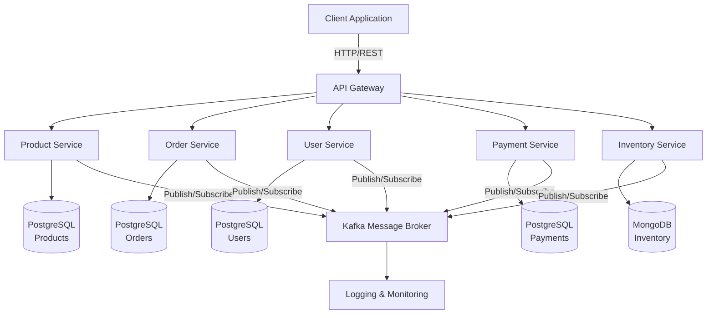
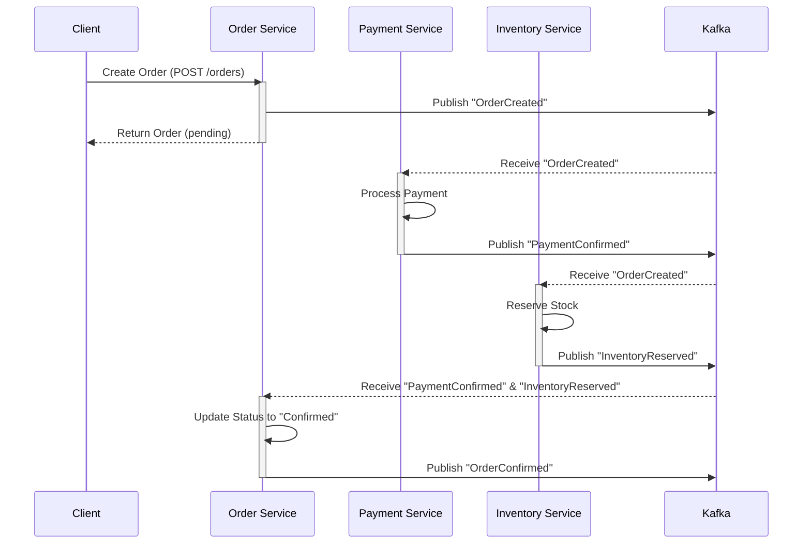
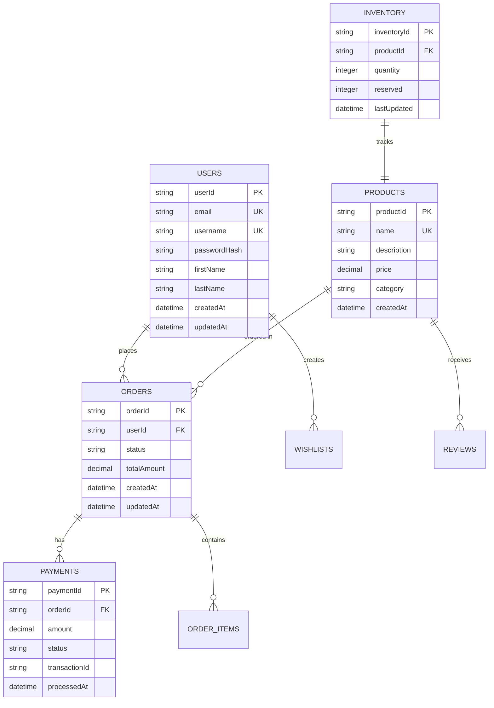
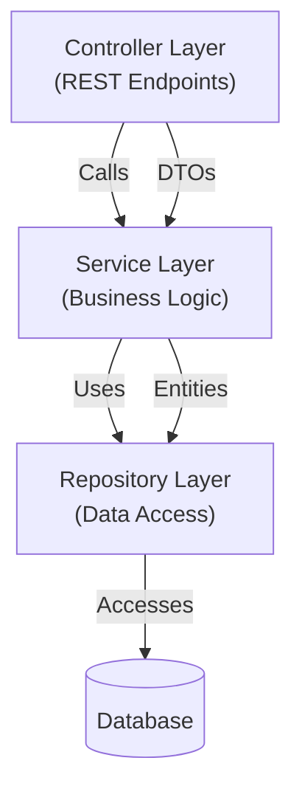
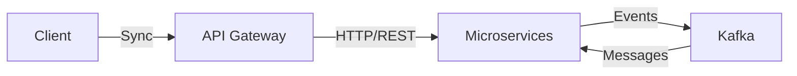

# Ecommerce App - Microservices Architecture

> A comprehensive microservices-based e-commerce platform built with Spring Boot 3, Java 17, and modern cloud-native technologies.

## Table of Contents

- [Overview](#overview)
- [Architecture](#architecture)
- [Services](#services)
- [Technology Stack](#technology-stack)
- [Project Structure](#project-structure)
- [Getting Started](#getting-started)
- [Docker Deployment](#docker-deployment)
- [Database](#database)
- [API Documentation](#api-documentation)
- [Contributing](#contributing)

## Overview

This project implements a scalable e-commerce platform using a microservices architecture pattern. Each service is independently deployable, maintainable, and scalable, following Domain-Driven Design (DDD) principles.

### Key Features

- Independent microservices for different business domains
- Spring Boot 3 with Spring Cloud ecosystem
- Docker containerization with Docker Compose orchestration
- Event-driven communication (Kafka)
- PostgreSQL and MongoDB for data persistence
- REST API with comprehensive error handling
- Distributed tracing and monitoring ready

## Architecture

### System Architecture Diagram



## Services

### 1. Product Service
**Responsibility:** Manage product catalog, categories, and product information.

- RESTful APIs for CRUD operations on products
- Product search and filtering capabilities
- Category management
- Product rating and reviews
- Publishes: `ProductCreated`, `ProductUpdated`, `ProductDeleted` events

### 2. Order Service
**Responsibility:** Handle order creation, management, and fulfillment.

- Order creation and management
- Order status tracking
- Saga pattern for distributed transactions
- Subscribes to: `PaymentConfirmed`, `InventoryReserved` events
- Publishes: `OrderCreated`, `OrderConfirmed`, `OrderCancelled` events

### 3. User Service
**Responsibility:** Manage user profiles, authentication, and authorization.

- User registration and profile management
- Authentication and JWT tokens
- User preferences and wishlists
- Publishes: `UserCreated`, `UserUpdated` events

### 4. Payment Service
**Responsibility:** Handle payment processing and transactions.

- Payment processing integration
- Transaction management
- Payment status tracking
- Subscribes to: `OrderCreated` events
- Publishes: `PaymentInitiated`, `PaymentConfirmed`, `PaymentFailed` events

### 5. Inventory Service
**Responsibility:** Manage product stock and reservations.

- Stock level management
- Inventory reservations for orders
- Stock updates and notifications
- Subscribes to: `OrderCreated`, `OrderCancelled` events
- Publishes: `InventoryReserved`, `InventoryReleased` events

## Data Flow & Event Choreography



## Database Design

### Service-Specific Databases



## Technology Stack

### Core Technologies

```mermaid
xychart-beta
    x-axis [Backend, Data, Messaging, DevOps, Monitoring]
    y-axis "Usage" 0 --> 10
    line [9, 8, 7, 8, 6]
```

**Backend:**
- Java 17 LTS
- Spring Boot 3.x
- Spring Cloud (Service Discovery, Config Server, Gateway)
- Spring Data JPA / MongoDB
- Spring Security with JWT
- Jakarta EE

**Data Persistence:**
- PostgreSQL (Relational Data)
- MongoDB (Document Storage)
- Redis (Caching)

**Messaging & Events:**
- Apache Kafka (Event Streaming)
- Spring Cloud Stream

**Containerization & Orchestration:**
- Docker
- Docker Compose
- Docker Networking

**Build & Dependency Management:**
- Maven 3.8+
- Spring Boot Maven Plugin

**Monitoring & Logging:**
- SLF4J with Logback
- Spring Boot Actuator
- Micrometer for Metrics

## Project Structure

```
Ecommerce-App-MicroServices/
├── services/
│   ├── product-service/
│   │   ├── src/
│   │   │   ├── main/java/com/ecommerce/product/
│   │   │   │   ├── controller/
│   │   │   │   ├── service/
│   │   │   │   ├── repository/
│   │   │   │   ├── entity/
│   │   │   │   ├── dto/
│   │   │   │   └── exception/
│   │   │   └── resources/
│   │   │       ├── application.yml
│   │   │       └── application-docker.yml
│   │   ├── pom.xml
│   │   └── Dockerfile
│   ├── order-service/
│   ├── user-service/
│   ├── payment-service/
│   └── inventory-service/
├── docker-compose.yml
├── notes/
│   └── [Architecture & Design Documents]
└── README.md
```

## Getting Started

### Prerequisites

- Java 17 or higher
- Maven 3.8+
- Docker & Docker Compose
- Git

### Local Development Setup

1. **Clone the repository:**
   ```bash
   git clone https://github.com/MahmoudHaifawi/Ecommerce-App-MicroServices.git
   cd Ecommerce-App-MicroServices
   ```

2. **Install dependencies:**
   ```bash
   mvn clean install
   ```

3. **Build all services:**
   ```bash
   mvn clean package
   ```

## Docker Deployment

### Using Docker Compose

Start all services with a single command:

```bash
docker-compose up -d
```

Services will be available at:
- **API Gateway:** http://localhost:8080
- **Product Service:** http://localhost:8081
- **Order Service:** http://localhost:8082
- **User Service:** http://localhost:8083
- **Payment Service:** http://localhost:8084
- **Inventory Service:** http://localhost:8085

### Stop Services

```bash
docker-compose down
```

### View Logs

```bash
docker-compose logs -f [service-name]
```

## Database

### PostgreSQL Setup

Connected services: Product, Order, User, Payment

```bash
docker exec -it postgres psql -U admin -d ecommerce
```

### MongoDB Setup

Connected services: Inventory

```bash
docker exec -it mongodb mongo --eval "db.version()"
```

### Kafka Broker

```bash
# List topics
docker exec -it kafka kafka-topics --list --bootstrap-server localhost:9092

# Create topic
docker exec -it kafka kafka-topics --create --topic order-events \
  --bootstrap-server localhost:9092 --partitions 3 --replication-factor 1
```

## API Documentation

### Service Communication Patterns

**Synchronous (REST):**
- Internal service-to-service calls via HTTP
- API Gateway routes external requests

**Asynchronous (Event-Driven):**
- Services publish domain events to Kafka
- Event subscribers react to state changes
- Eventual consistency model

### Common API Response Format

```json
{
  "data": {},
  "meta": {
    "timestamp": "2024-01-01T12:00:00Z",
    "version": "1.0"
  },
  "errors": null
}
```

## Configuration Management

Each service includes:

- `application.yml` - Default configuration
- `application-docker.yml` - Docker-specific configuration
- Environment-based overrides via Docker Compose

## Health Checks

All services expose health endpoints:

```bash
curl http://localhost:8081/actuator/health
```

## Development Guidelines

### Spring Boot Best Practices

1. **Dependency Injection** - Use constructor injection for mandatory dependencies
2. **Logging** - Use SLF4J with descriptive messages
3. **Exception Handling** - Custom exceptions with proper HTTP status codes
4. **Testing** - Unit and integration tests for all services
5. **Documentation** - JavaDoc for public APIs

### Code Structure

Each microservice follows this layered architecture:



## Microservices Communication Flow



## Contributing

1. Create a feature branch: `git checkout -b feature/your-feature`
2. Commit changes: `git commit -m 'Add your feature'`
3. Push to branch: `git push origin feature/your-feature`
4. Submit a Pull Request

### Code Quality Standards

- Follow Google Java Style Guide
- Maintain test coverage above 80%
- Add JavaDoc for public methods
- Update README for architectural changes

## License

This project is licensed under the MIT License - see LICENSE file for details.

## Support & Contact

For issues and questions, please create an issue on GitHub.

---

**Last Updated:** December 2025
**Version:** 1.0.0
