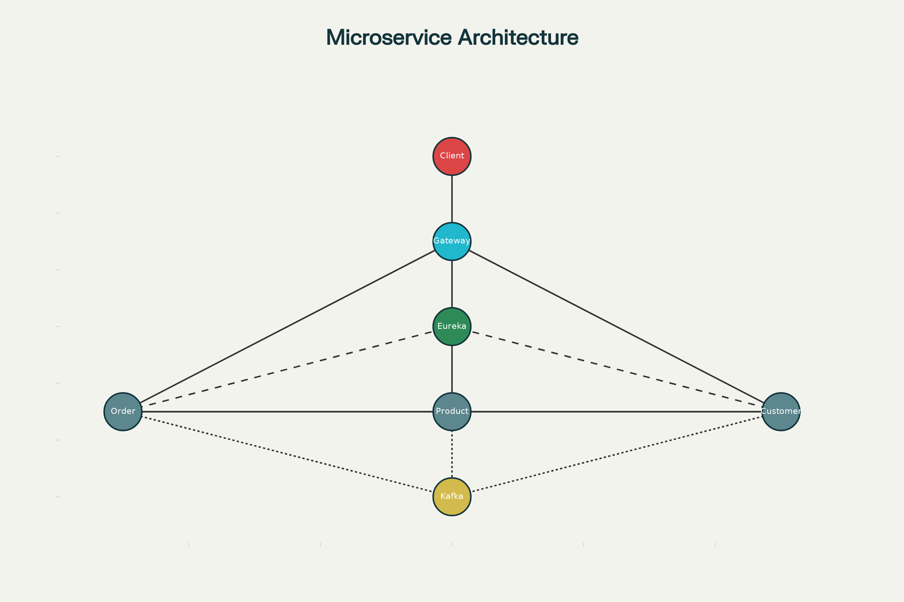

# Internal Microservice Communication: Why Not Hardcode Addresses?

In modern microservice architectures (like those in Spring Boot, Spring Cloud, and the course video), **services do not call each other by hardcoded network addresses or ports**. Instead, they use *service discovery, dynamic load balancing, and logical names* so the system is robust, scalable, and easy to maintain.

---

## Principles of Internal Microservice Communication

### 1. **No Fixed Addresses**
- Microservices **do not connect to each other using static IPs/ports** (e.g., not `http://localhost:8081/`).
- Networks are dynamic: scaling, redeployment, and failures change addresses frequently.

### 2. **Service Discovery (Eureka)**
- Each service **registers itself with Eureka** (a service discovery server).
- When Service A (e.g., Order Service) wants to call Service B (e.g., Product Service), it **looks up the logical name** ("product-service") using Eureka to get the live address and port.

    - **Example**: Instead of `http://localhost:8082/product`, use `http://product-service/api/v1/products`. Eureka resolves the actual location.

### 3. **Load Balancing**
- **Spring Cloud LoadBalancer** automatically spreads requests across all available service instances.
- Clients use the *service name*, not an IP address.

### 4. **Internal Communication Methods**
- **Synchronous REST calls**:
    - Use Spring `RestTemplate` or `OpenFeign` with service names instead of hardcoded hosts.
    - Example:
      ```
      @FeignClient(name = "product-service")
      public interface ProductClient {
          @GetMapping("/api/v1/products/{id}")
          Product getProduct(@PathVariable String id);
      }
      ```
- **Asynchronous Messaging**:
    - Events (like “order created”) published to Kafka topics, consumed by other services.

### 5. **Why Not Hardwire Internal Addresses?**
- **Scalability**: Easily scale services up/down without changing configs.
- **Reliability**: Handle failures and restarts gracefully.
- **Flexibility**: Redeploy and update services independently.
- **No Network Hassle**: No need to track changing IPs/ports in configs.

### 6. **API Gateway Is Not Used for Internal Calls**
- API Gateway is used for **external client calls only**, not service-to-service.
- Internal calls rely on **Eureka + REST or messaging**, not routed through the gateway.

---

## Markup Table: Internal Communication Patterns

| Communication Pattern    | Implementation         | Example                              |
|-------------------------|------------------------|--------------------------------------|
| Service Discovery       | Eureka                 | Lookup with logical service names    |
| Load Balancing          | Spring Cloud LB        | Balancing among all instances        |
| REST (sync)             | Feign/RestTemplate     | Call via service name, not address   |
| Messaging (async)       | Kafka                  | Publish/subscribe to topics          |
| API Gateway             | Spring Cloud Gateway   | Only for public/external traffic     |

---

## **Summary**

- **Use service discovery, not static addresses, for internal service communication.**
- Microservices interact via **dynamic, logical names**—not hardcoded hosts/ports.
- This enables scaling, resilience, and easy maintenance in cloud-native environments.

